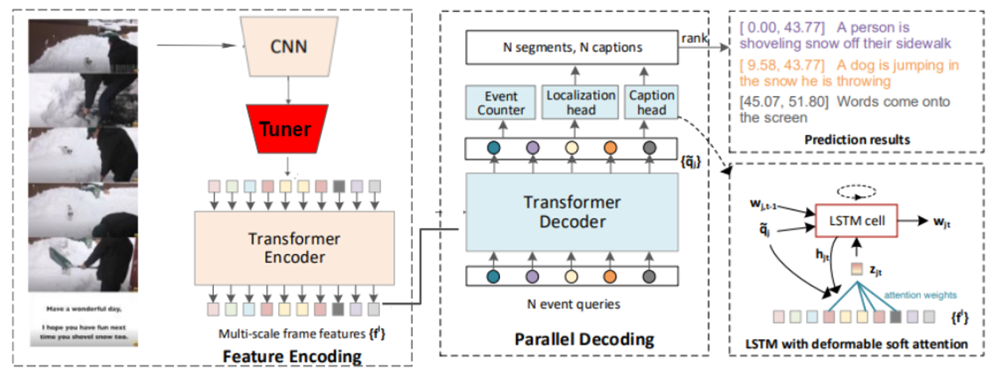

# Modified PDVC with Semantic Alignment

Modified Implementation for End-to-End Dense Video Captioning with Parallel Decoding and Semantic Alignment
[[paper]](https://github.com/ologandavid/DenseVideoCaptioning/blob/main/Documents/FinalReport.pdf)

Original Implementation for End-to-End Dense Video Captioning with Parallel Decoding (ICCV 2021) 
[[paper]](https://arxiv.org/abs/2108.07781)

**This repo supports:**
* two video captioning tasks: dense video captioning and video paragraph captioning
* dataset: YouCook2
* video features containing TSN
* visualization of the generated captions of your own videos

**Table of Contents:**
* [Updates](#updates)
* [Introduction](#introduction)
* [Preparation](#preparation)
* [Running PDVC on Your Own Videos](#running-pdvc-on-your-own-videos)
* [Training and Validation](#training-and-validation)
  + [Download Video Features](#download-video-features)
  + [Dense Video Captioning](#dense-video-captioning)
  + [Video Paragraph Captioning](#video-paragraph-captioning)
* [Performance](#performance)
  + [Dense video captioning](#dense-video-captioning)
  + [Video paragraph captioning](#video-paragraph-captioning)
* [Acknowledgement](#acknowledgement)


## Updates
- (2023.05.05) **added tuner network into PDVC framework to semantically align input video features. Tuner .pth files can be found in ./model_files.**
- (2021.11.19) add code for running PDVC on raw videos and visualize the generated captions (support Chinese and other non-English languages)
- (2021.11.19) add pretrained models with [TSP features](https://github.com/HumamAlwassel/TSP). It achieves 9.03 METEOR(2021) and 6.05 SODA_c, a very competitive results on ActivityNet Captions without self-critical sequence training.
- (2021.08.29) add TSN pretrained models and support YouCook2

## Introduction
The basis of this model is [PDVC](https://github.com/ttengwang/PDVC). PDVC is a simple yet effective framework for end-to-end dense video captioning with parallel decoding (PDVC), by formulating the dense caption generation as a set prediction task. It is shown that through using a tuner network which semantically aligns the video features, the overall performance PDVC can be improved across all metrics. This tuner model has been trained exclusively on the YouCook2 dataset.


## Installation
Environment: Linux,  GCC>=5.4, CUDA >= 9.2, Python>=3.7, PyTorch>=1.5.1

1. Clone the repo
```bash
git clone --recursive https://github.com/ttengwang/PDVC.git
```

2. Create vitual environment by conda
```bash
conda create -n PDVC python=3.7
source activate PDVC
conda install pytorch==1.7.1 torchvision==0.8.2 cudatoolkit=10.1 -c pytorch
conda install ffmpeg
pip install -r requirement.txt
sudo apt-get install build-essential
sudo apt-get install ubuntu-drivers-common
sudo apt-get ubuntu-drivers autoinstall
sudo apt install nvidia-cuda-toolkit
```

3. Compile the deformable attention layer (requires GCC >= 5.4). 
```bash
cd pdvc/ops
sh make.sh
```

## Running PDVC on Your Own Videos
Download a pretrained model ([GoogleDrive](https://drive.google.com/drive/folders/1sX5wTk1hBgR_a5YUzpxFCrzwkZQXiIab?usp=sharing)) with [TSP](https://github.com/HumamAlwassel/TSP) features  and put it into `./save`. Then run:
```bash
video_folder=visualization/videos
output_folder=visualization/output
pdvc_model_path=save/anet_tsp_pdvc/model-best.pth
output_language=en
bash test_and_visualize.sh $video_folder $output_folder $pdvc_model_path $output_language
```
check the `$output_folder`, you will see a new video with embedded captions. 
Note that we generate non-English captions by translating the English captions by GoogleTranslate. 
To produce chinese captions, set `output_language=zh-cn`. 
For other language support, find the abbreviation of your language at this [url](https://github.com/lushan88a/google_trans_new/blob/main/constant.py), and you also may need to download a font supporting your language and put it into `./visualization`.


## Training and Validation

### Download Video Features

```bash
cd data/yc2/features
bash download_yc2_tsn_features.sh

```

### Dense Video Captioning
```
1. Train and Eval PDVC
# Training
config_path=cfgs/yc2_tsn_pdvc.yml
python train.py --cfg_path ${config_path} --gpu_id ${GPU_ID}
# The script will evaluate the model for every epoch. The results and logs are saved in `./save`.

# Evaluation
eval_folder=yc2_tsn_pdvc_baseline # specify the folder to be evaluated
eval_caption_file=data/yc2/captiondata/yc2_val.json
python eval.py --eval_folder ${eval_folder} --eval_caption_file ${eval_caption_file} --eval_transformer_input_type queries
# This script returns the Soda_c scores

eval_json=save/yc2_tsn_pdvc_baseline/2023-04-18-03-29-07_yc2_tsn_pdvc_v_2023-04-18-00-02-08_epoch19_num457_alpha1.0.json_rerank_alpha1.0_temp2.0.json
# Replace this with the json file in the save folder generated during training

python densevid_eval3/evaluate2018.py -v -s ${eval_json} -r data/yc2/captiondata/yc2_val.json

```
2. Tuner Model Training Pipeline

<!-- 2. PDVC with ground-truth proposals

```
# Training
config_path=cfgs/anet_c3d_pdvc_gt.yml
python train.py --cfg_path ${config_path} --gpu_id ${GPU_ID}

# Evaluation
eval_folder=anet_c3d_pdvc_gt
python eval.py --eval_folder ${eval_folder} --eval_transformer_input_type gt_proposals --gpu_id ${GPU_ID}
``` -->

## Performance
### Dense video captioning (with learnt proposals)

|  Model | Features | config_path |   Url   |   BLEU4   | METEOR |  CIDEr | SODA_c |
|  ----  |  ----    |   ----  |  ----  |  ----   |  ----  |   ----  |  ----  |
| Baseline PDVC   | TSN  | cfgs/yc2_tsn_pdvc.yml | [model](https://github.com/ttengwang/PDVC)  |  0.76 ± 0.05   |  4.39 ± 0.07  | 20.68 ± 0.21  |  4.47 ± 0.87  |
| Linear   | TSN  | cfgs/yc2_tsn_pdvc.yml |  [model](https://github.com/ologandavid/DenseVideoCaptioning/blob/main/model_files/ACTUAL_Linear1_imp.pth)  |  0.87 ± 0.06   |  4.74 ± 0.09  | 21.76 ± 0.04  |  4.45 ± 1.13  |
| Conv1   | TSN | cfgs/yc2_tsn_pdvc.yml | [model](https://github.com/ologandavid/DenseVideoCaptioning/blob/main/model_files/ACTUAL_conv1_imp_bn.pth)  |  0.90 ± 0.02   |  4.53 ± 0.07  | 22.32 ± 0.05  |  4.50 ± 1.48 |
| Conv1 w/ Linear   | TSN  | cfgs/yc2_tsn_pdvc.yml | [model](https://github.com/ologandavid/DenseVideoCaptioning/blob/main/model_files/ACTUAL_conv1_linear_imp.pth)  |  0.77 ± 0.15   |  4.48 ± 0.02  | 21.07 ± 0.92  |  4.47 ± 1.49  |
| Conv2   | TSN | cfgs/yc2_tsn_pdvc.yml | [model](https://github.com/ologandavid/DenseVideoCaptioning/blob/main/model_files/ACTUAL_conv2_imp.pth)  |  0.40 ± 0.08   |  3.35 ± 0.01  | 14.34 ± 0.02  |  3.53 ± 0.71  |

## Acknowledgement

The implementation of Deformable Transformer is mainly based on [Deformable DETR](https://github.com/fundamentalvision/Deformable-DETR). 
The implementation of the captioning head is based on [ImageCaptioning.pytorch](https://github.com/ruotianluo/ImageCaptioning.pytorch).
We thanks the authors for their efforts.

The base framework for PDVC is located [here](https://github.com/ttengwang/PDVC.git). We encourage you to take a look at their repo.

```
@inproceedings{wang2021end,
  title={End-to-End Dense Video Captioning with Parallel Decoding},
  author={Wang, Teng and Zhang, Ruimao and Lu, Zhichao and Zheng, Feng and Cheng, Ran and Luo, Ping},
  booktitle={Proceedings of the IEEE/CVF International Conference on Computer Vision},
  pages={6847--6857},
  year={2021}
}
```

